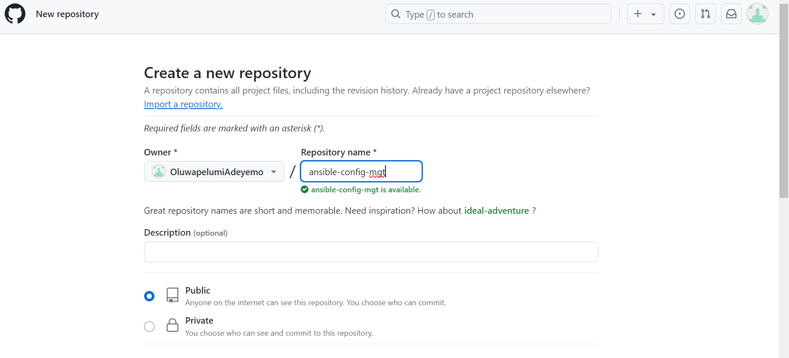

## Install and configure ansible on ec2 instance
Install and Configure Ansible on EC2 Instance

## Create a new repository called ansible-config-mgt in your GitHub account.

## Update the Name tag on your Jenkins EC2 Instance to Jenkins-Ansible. This server will be used to run playbooks.
Install Ansible on the Jenkins-Ansible server.

## To check for ansible version

## In order to access ansible through the web browser, go to your EC2 instance inbound rule and open TCP port 8080, IPV4 anywhere

## It is important to note that Jenkins wont work until Java is installed, hence, we need to install Java language before you can use Jenkins

## To confirm that java is running

## Install Jenkins

## To check Jenkins Status

## Check with the url

## Set the default password

## Check the output

## Login to Jenkins

## Configure Jenkins build job to archive your repository content every time you change it.

## Configure a Post-build job to save all (**) files.
Configure a webhook in GitHub and set the webhook to trigger ansible build.

## Create a playbooks (i.e. used to store all the playbook files) and inventory (i.e. used to keep your hosts organized) directory.

## se the Ansible Adhoc command to check if wireshark has been installed on the servers.
ansible webservers -i inventory/dev -m command -a "wireshark --version"

