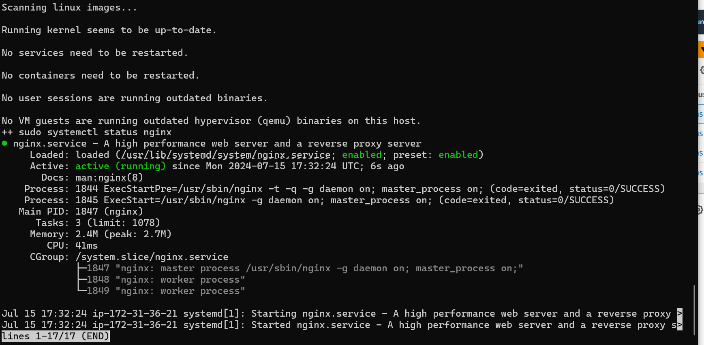

## Automate the deployment of webservers
Deploying and configuring 2 webservers
Provision two EC2 Instances
Open Port 80 & 8000 repectively on all servers to allow traffic from AnyWhere

## Open a file, paste the script below in the 2 web servers and close the file using the command below;
sudo nano install.sh

## Change the permissions for both servers on the file to make it executable using the command below
sudo chmod +x install.sh

Run the shell script using the command below. Read the instructions in the shell script to learn how to use it. - Public IP of my 2 web server created in the EC2 instance - Web Server 1 - 13.51.198.3 & Web Server 2 - 13.53.197.31
./install.sh PUBLIC_IP

## Change the permissions for both servers on the file to make it executable using the command below
sudo chmod +x install.sh

## Web Browser Display for web server

## Open a file nginx.sh using the command sudo nano nginx.sh in the load balancer

sudo nano nginx.sh

## Run the chmod permission command below;
sudo chmod +x nginx.sh

## Run the script with the command below;
Note: Public IP of the load balancer which is the EC2 instance and the public IPs of the 2 web servers I'd created for this project 8

