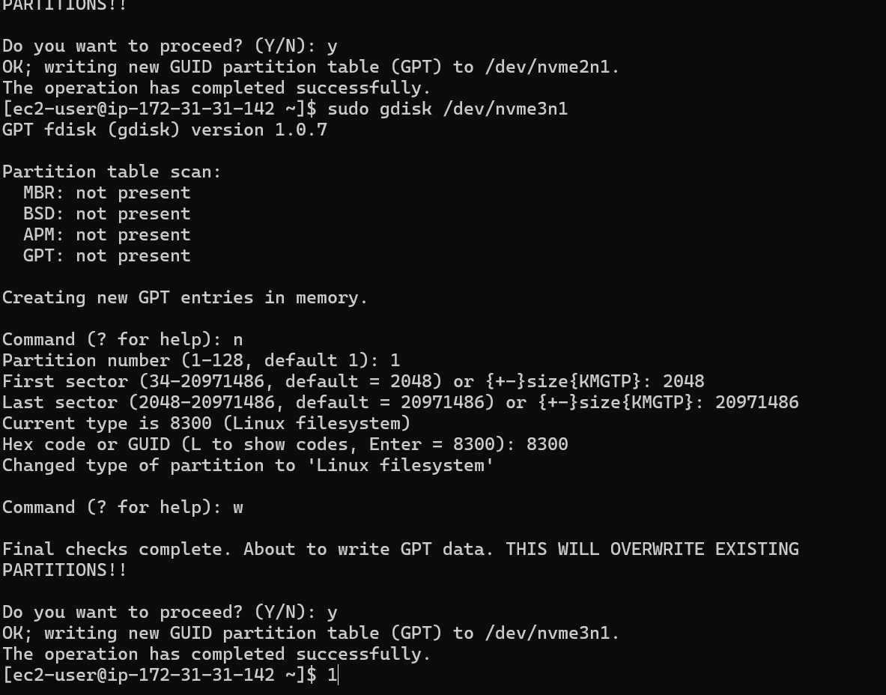
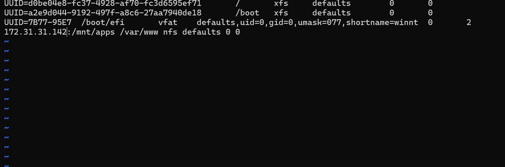

## DevOps-Tooling-Website-Solution
## Prepare NFS Server
Spin up a new EC2 instance with RHEL Linux 8 Operating System.

## To install the lvm2 package run the below command;
sudo yum install lvm2

## To see all mount and free space on the web-server
df -h

## Create single partitions
To create a single partition on each of the disk using the gdisk Utility, run the below command:
sudo gdisk /dev/nvme1n1
sudo gdisk /dev/nvme2n1
sudo gdisk /dev/nvme3n1

## Run the below command to check for available partitions
sudo lvmdiskscan

## To verify that the physical volume has been created successfully
sudo pvs

## To add all the three Physical volumes(Pvs) to a Volume Group (VG). Name the VG webdata-vg
sudo vgcreate webdata-vg /dev/nvme1n1p1 /dev/nvme2n1p1 /dev/nvme3n1p1

## To create 3-logic Volumes lv-opt, lv-apps and lv-logs, run the below commands;
sudo lvcreate -n lv-apps -L 9G webdata-vg 
sudo lvcreate -n lv-logs -L 9G webdata-vg 
sudo lvcreate -n lv-opt -L 9G webdata-vg

## To format the logical Volumes with xfs file system using mkfs.xfs
sudo mkfs -t xfs /dev/webdata-vg/lv-opt
sudo mkfs -t xfs /dev/webdata-vg/lv-apps
sudo mkfs -t xfs /dev/webdata-vg/lv-logs

## Create mount points on /mnt directory for the logical volumes as follow:
sudo mkdir /mnt/apps
sudo mkdir /mnt/logs
sudo mkdir /mnt/opt

## To mount /mnt/apps on lv-apps logical volume
sudo mount /dev/webdata-vg/lv-apps /mnt/apps
- To mount /mnt/logs on lv-apps
sudo mount /dev/webdata-vg/lv-logs /mnt/logs

## Use rsync utility to backup all the files in the log directory /var/log into /mnt/logs (This is required before mounting the file system).
sudo rsync -av /var/log/. /mnt/logs

## To Mount /var/log on logs-lv logical volume. (Note that all the existing data on /var/log will be deleted).
sudo mount /dev/webdata-vg/lv-logs /var/log

## To install NFS server, run the below command;
sudo yum -y update

## To verfify the installation

## Export the mount for webserver subnet cidr to connect as clients. For simplicity, you will install the three webservers inside the subnet, but in production set up you would probably want to seperate each tier inside its own subnet for higher level of security.

## To configure access to NFS for clients within the same subnets, run the below command;
sudo vi /etc/exports

## Set up a MySQL Database Instance

## MySQL server Installation

## sudo mysql
Run the below command in the database environment. % means - any IP range under that
sudo mysql
CREATE DATABASE tooling;
CREATE USER `myuser`@`<NFS-Server-Subnet CIDR-IP-Address>` IDENTIFIED BY 'mypass';
GRANT ALL ON tooling.* TO 'myuser'@'<NFS-Server-Subnet CIDR-IP-Address>';
FLUSH PRIVILEGES;
SHOW DATABASES;
exit

## Change the bind-address and mysqlx-bind-addresses to 0.0.0.0
sudo vi /etc/mysql/mysql.conf.d/mysqld.cnf

## sudo systemctl restart mysql
sudo systemctl status mysql

## Create a new web Instance

## Verify that NFS was mounted successfully by running of df -h . Make sure that the changes will persist on Web Server after reboot:
sudo vi /etc/fstab

## Install Apache

## Install php remi's repo

## Sudo Install git

## git clone

## git list

## Check the status to see if it's running

## Create in MySQL a new admin user with username: myuser and password: password:

## Open the website in your browser
http://<Web-Server-Public-IP-Address-or-Public-DNS-Name>/index.php

## The expected outcome

