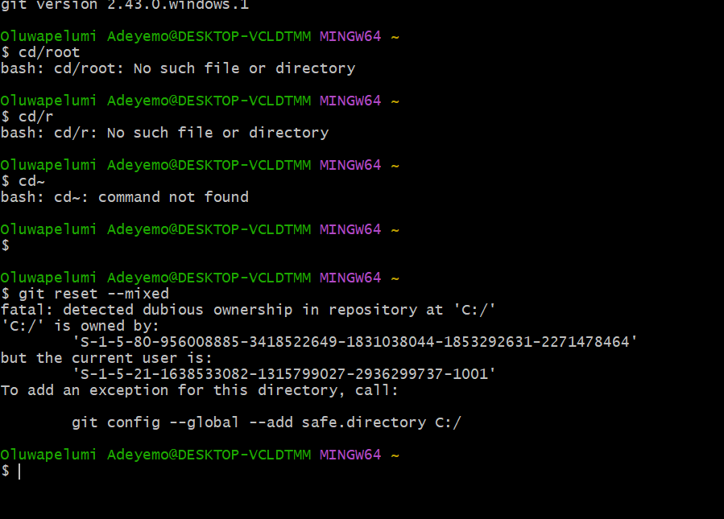
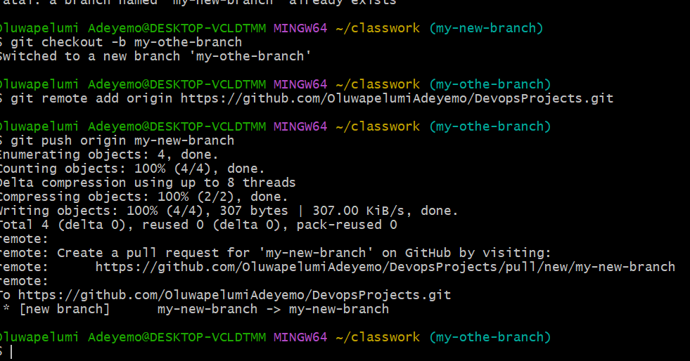

# These are my github project screenshots!
## Images!

**This git reset command is used to reset the directory**

**The Mkdir command for creating a new directoy**

**git add . and git commit:This command is used to add changes to git staging**

**The touch command is used to create a file inside the working folder**

**The branch command helps us to create a diffrent copy of our source code**

**The gitorigin command is used to push contents to the remote repository after commiting changes in the local repository**

**gitclone command is used to make a copy of our remte repository in our local machine**

