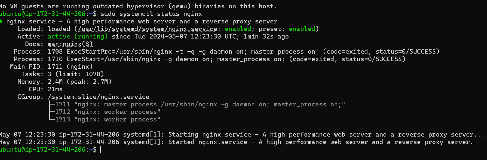
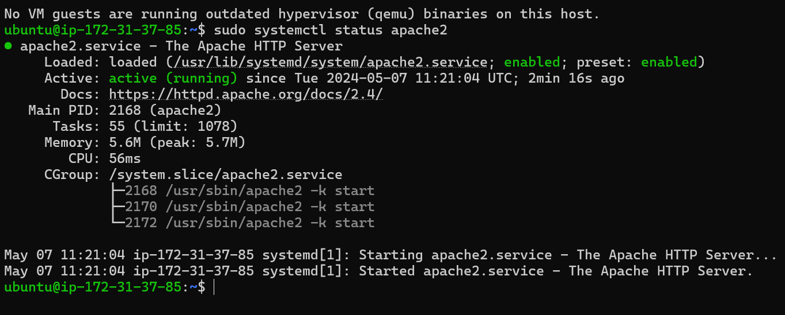
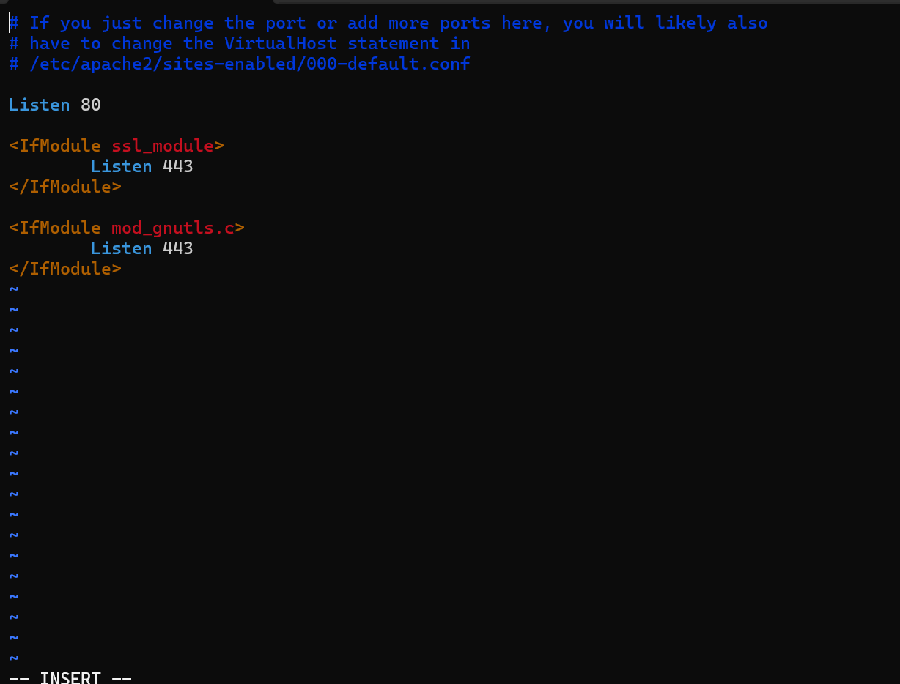
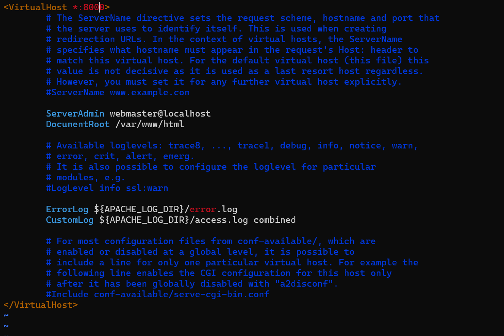
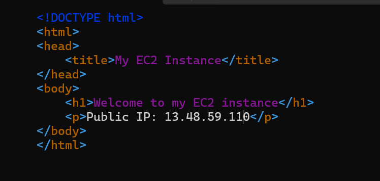
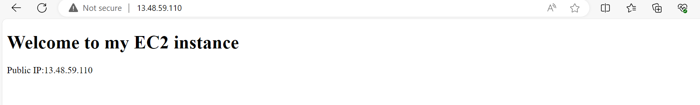
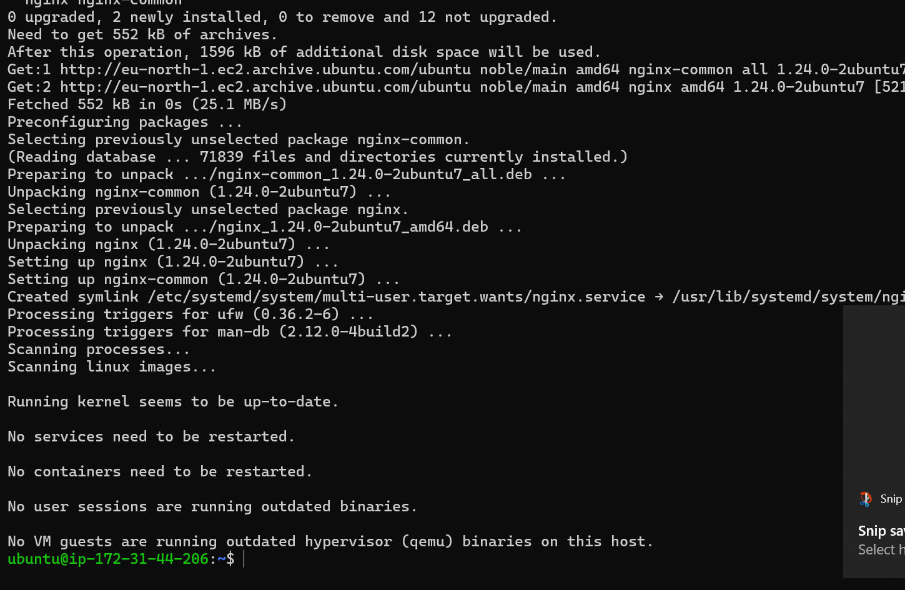
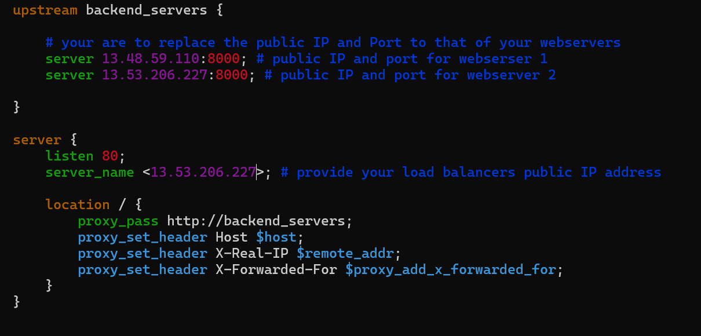
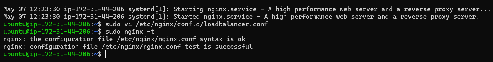
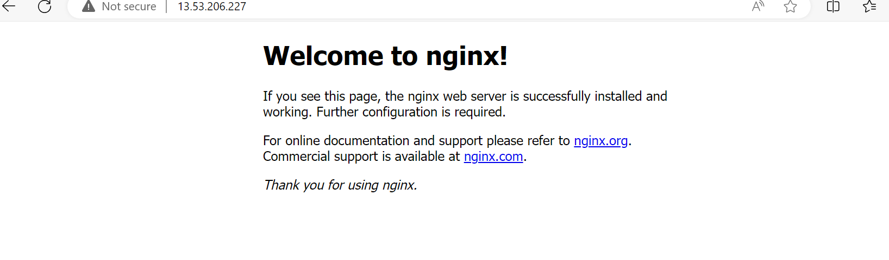

# IMPLEMENTING LOAD BALANCING WITH NGINX

## Provision EC2 Instance
Open the AWS Console and create the instances

## Open Port 8000, we will be running our webservers on port 8000 while the load balancers run port 80. we will need to open port 8000 to allow traffic from anywhere. To do this we need to add a rule to the security group of each of our webserver.
Click On the instance ID to get of your EC2 instances.
Load-balancer - Apache

Connect via ssh for both Servers
Apache 1

## Install Apache on both Webservers using the below commands;
sudo apt update -y

## sudo systemctl status apache2

## To configure Apache to serve content on port 8000.

Using the nano text editor, open the file/etc/apache2/ports.conf
sudo nano /etc/apache2/ports.conf 

## On both servers, open the file /etc/apache2/sites-available/000-default.conf , and change port 80 on the virtualhost to 8000.
sudo nano /etc/apache2/sites-available/000-default.conf

## A Welcome Web Browser Apache 1 & 2 Servers

## Install Nginx
sudo apt update -y && sudo apt install nginx -y

## Verify Nginx is installed and working
sudo systemctl status nginx

## Open Nginx Configuration File
sudo nano /etc/nginx/conf.d/loadbalancer.conf

## To test Configuration, Run
sudo nginx -t

## In the web browser paste the Ip-address of the Nginx load paste and hit enter.

THE RESULT
Load-balancer apache

