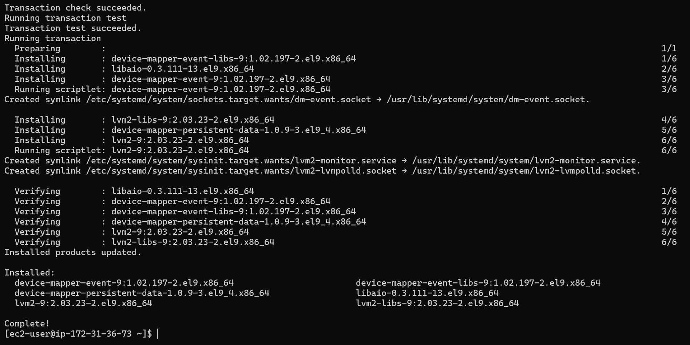
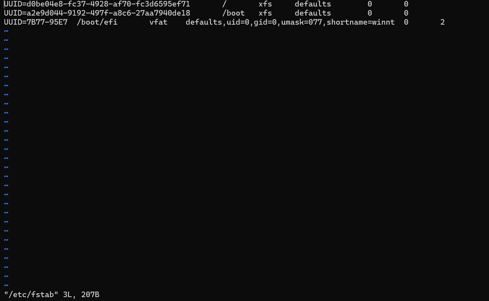

## IMPLEMENTING WORDPRESS WEBSITE WITH LOGIC VOLUME MANAGEMENT (LVM) STORAGE MANAGEMENT

## Step 1 - PREPARE A WEB SERVER.
-Launch an EC2 instance the will serve as "Web Server"
- Create 3 Volumes in the same Az as your Web server EC", each of 10gigs
- Launching an EC2 Instance called Web-Server with a Redhat OS
  

## Create 3 volumes , 10Gb each.

## To attach each Volume one by one to the Webserver EC2 Instance
Click on the Volume and right click to select the attach option.
Select the Web-server EC2 instance and click attach

## To connect to redhat ec2 instance

To inspect what block device is attched to the server
lsblk

## To see all mount and free space on the web-server
df -h

## To create a single partition on each of the disk using the gdisk Utility, run the below command:
sudo gdisk /dev/nvme1n1
sudo gdisk /dev/nvme2n1
sudo gdisk /dev/nvme3n1
Run a new entry by entering n and click the number of partition in this case 1
Click yes to complete the process

## To view the newly configured partition on each of the 3 disks
lsblk 

## Run the below command to check for available partitions
sudo lvmdiskscan

## To mark each of the three disks as physical Volumes(Pvs) to be used by LVM, run the below commands
sudo pvcreate /dev/nvme1n1p1 
sudo pvcreate /dev/nvme2n1p1 
sudo pvcreate /dev/nvme3n1p1

## To verify that the physical volume has been created successfully

## To verify the logic Volumes has been created successfully.
sudo lvs

## To mount var/log on logs-lv logical volume
sudo mount /dev/webdata-vg/logs-lv /var/log

## Install lvm2 package using the below command;
sudo yum install lvm2

## To view the available partitions

##To update /etc/fstab so that the mount configuration will persist after restart. Copy the UUID of the device to upate the /etc/fstab
sudo blkid

## To test the configuration and reload the Daemon
sudo mount -a 
AND
sudo systemctl daemon-reload

## To verify the set up is running well
df -h

## HEADING - INSTALLING WORDPRESS AND CONFIGURING IT TO USE MYSQL DATABASE
STEP-2 PREPARING THE DATABASE SERVER
Repeating the same step above, BUt instead of apps-lv create db-lv and mount it into directory /db instead of /var/www/html
Launch an EC2 instance DB-serveron redhart OS

## Create and attach 3-volumes to the DB-Server

## STEP-3 INSTALLING WORDPRESS ON YOUR WEB SERVER EC2 INSTANCE
Before we install Wordpress, we would first update the reprository by running the below command
sudo yum -y update

## To install Apache, wget and its dependencies
sudo yum -y install wget httpd php php-mysqlnd php-fpm php-json

## To install PHP and its dependencies, run the below command;
sudo yum install https://dl.fedoraproject.org/pub/epel/epel-release-latest-8.noarch.rpm
sudo yum install yum-utils http://rpms.remirepo.net/enterprise/remi-release-8.rpm
sudo yum module list php
sudo yum module reset php
sudo yum module enable php:remi-7.4
sudo yum install php php-opcache php-gd php-curl php-mysqlnd

## To downlaod Wordpress and copy wordpress to var/www/html, run the below command;
mkdir wordpress
cd   wordpress
sudo wget http://wordpress.org/latest.tar.gz
sudo tar xzvf latest.tar.gz
sudo rm -rf latest.tar.gz
sudo cp wordpress/wp-config-sample.php wordpress/wp-config.php
sudo cp -R wordpress /var/www/html/

## STEP 4 - INSTALLING MYSQL ON YOUR DB SERVER EC2
To update and Install mysql-server
sudo yum update

## sudo yum install mysql-server

## To verify if the set-up is running
sudo systemctl restart mysqld
sudo systemctl status mysqld,

## CONFIGURE DB TO WORK WITH WORDPRESS
sudo mysql
CREATE DATABASE wordpress;
CREATE USER `myuser`@`<Web-Server-Private-IP-Address>` IDENTIFIED BY 'mypass';
GRANT ALL ON wordpress.* TO 'myuser'@'<Web-Server-Private-IP-Address>';
FLUSH PRIVILEGES;
SHOW DATABASES;
exit

 ## CONFIGURE WORDPRESS TO CONNECT TO REMOTE DATABASE
Open MYSQL port 3306 on DB-server and access it only from web-servers IP address
In the inbound rule configure source as /32

## To Install MySQL client on the web server and test that you can connect from Web-server to DB-server using mysql-client

sudo yum install mysql
On the Database Server, Create an admin user in mysql using the below parameter. This will be used to create a remote connection through the web server.

CREATE USER 'username'@'host' IDENTIFIED BY 'password';
Note: Username should be your desired name; host - replace host with the Subnet cidr of the webserver

## in the web server, vi into the wp-config file by runing the below command

sudo vi /var/www/html/wordpress/wp-config.php
Note - Replace the following with the real values. database_name_here with the wordpress, username_here with admin, password_here with the password of the admin, localhost with the private ip of the database server.

## Now, try to access from your browser link to the wordpress using your web server ip.

http://<web-server-public-ip-address>/wordpress/

