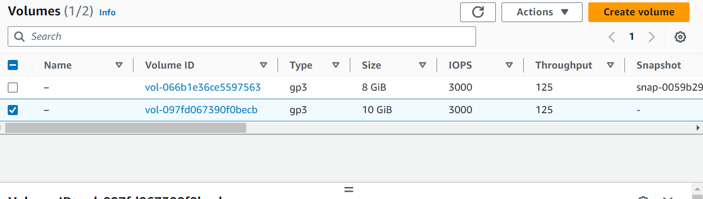

## IMPLEMENTING WORDPRESS WEBSITE WITH LOGIC VOLUME MANAGEMENT (LVM) STORAGE MANAGEMENT

## Step 1 - PREPARE A WEB SERVER.
-Launch an EC2 instance the will serve as "Web Server"
- Create 3 Volumes in the same Az as your Web server EC", each of 10gigs
- Launching an EC2 Instance called Web-Server with a Redhat OS
  

## Create 3 volumes , 10Gb each.

## To attach each Volume one by one to the Webserver EC2 Instance
Click on the Volume and right click to select the attach option.
Select the Web-server EC2 instance and click attach

## To connect to redhat ec2 instance

To inspect what block device is attched to the server
lsblk

## To see all mount and free space on the web-server
df -h

## To create a single partition on each of the disk using the gdisk Utility, run the below command:
sudo gdisk /dev/nvme1n1
sudo gdisk /dev/nvme2n1
sudo gdisk /dev/nvme3n1
Run a new entry by entering n and click the number of partition in this case 1
Click yes to complete the process

## To view the newly configured partition on each of the 3 disks
lsblk 

## Run the below command to check for available partitions
sudo lvmdiskscan

## To mark each of the three disks as physical Volumes(Pvs) to be used by LVM, run the below commands
sudo pvcreate /dev/nvme1n1p1 
sudo pvcreate /dev/nvme2n1p1 
sudo pvcreate /dev/nvme3n1p1

## To verify that the physical volume has been created successfully

## To verify the logic Volumes has been created successfully.
sudo lvs

## To mount var/log on logs-lv logical volume
sudo mount /dev/webdata-vg/logs-lv /var/log

## Install lvm2 package using the below command;
sudo yum install lvm2

## To view the available partitions

##To update /etc/fstab so that the mount configuration will persist after restart. Copy the UUID of the device to upate the /etc/fstab
sudo blkid

## To test the configuration and reload the Daemon
sudo mount -a 
AND
sudo systemctl daemon-reload

