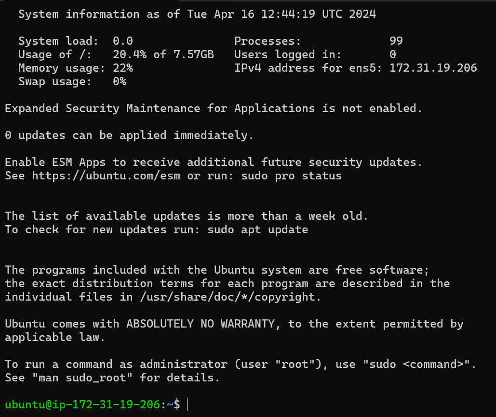
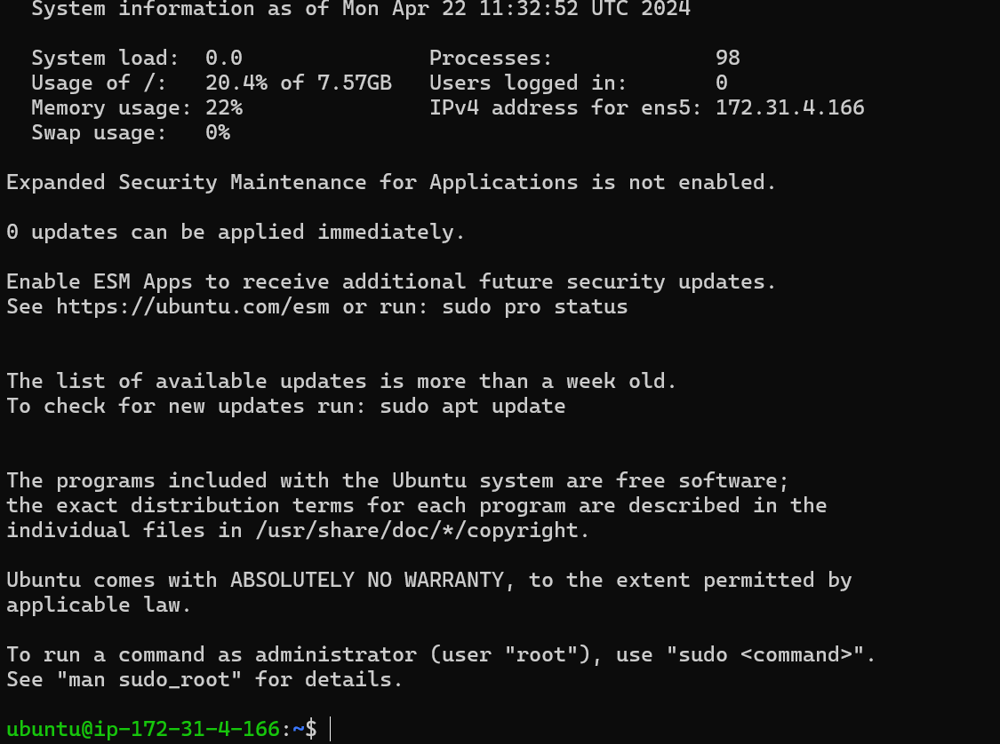
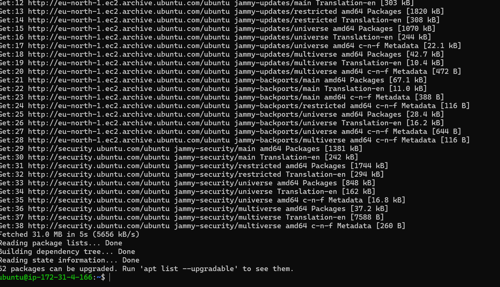
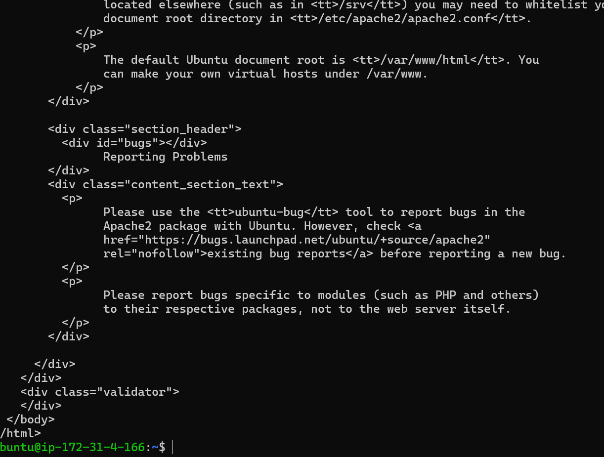

# My Lamp Stack Project!
## Web Stack Implementation (Web Stack in AWS)!

## This shows the succesful connection to the ec2 instance!

## This shows the succesful connection to the second ec2 instance

## Installing Apache using ubuntu's package manager 'apt'

## To verify that Apache2 is running as a service in our OS - sudo systemctl status nginx

## To access Nginx server via local machine
Run curl http://localhost:80
or curl http://127.0.0.1:80

