# My Lamp Stack Project!
## Web Stack Implementation (Web Stack in AWS)!

## This shows the succesful connection to the ec2 instance!

## This shows the succesful connection to the second ec2 instance

## Installing Apache using ubuntu's package manager 'apt'

## To verify that Apache2 is running as a service in our OS - sudo systemctl status nginx

## To access Nginx server via local machine
Run curl http://localhost:80
or curl http://127.0.0.1:80

## View the url in web browser to show that the web server is correctly installed

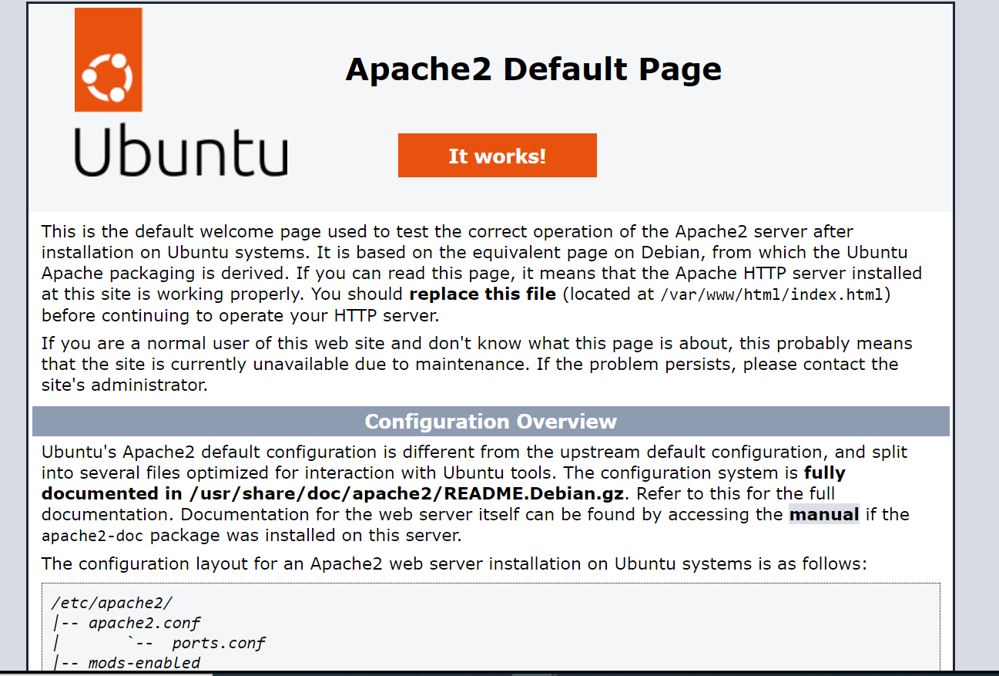

## To Install mysql on Nginx Server
sudo apt install mysql-server

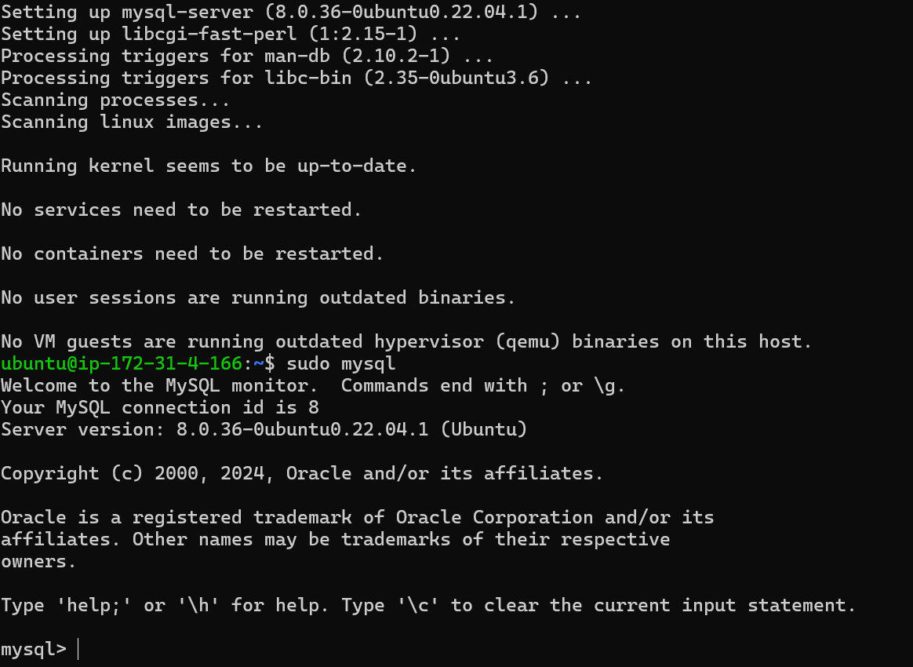

## To set password for the Root user ALTER USER 'root'@'localhost' IDENTIFIED WITH mysql_native_password BY 'PassWord.1';

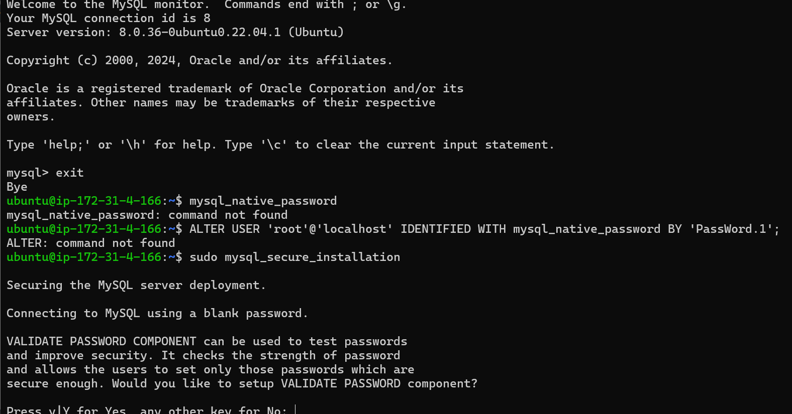

## To Install the 2 packages.
sudo apt install php-fpm php-mysql

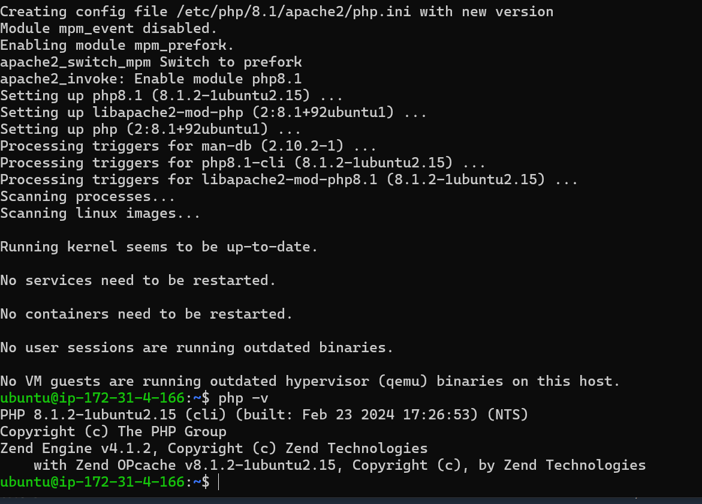

## Configuring Nginx to Use PHP Processor
Create a root web directory for your_domain as follows
sudo mkdir /var/www/projectLEMP
To cd into the root directory
sudo -i
cd /var/www/

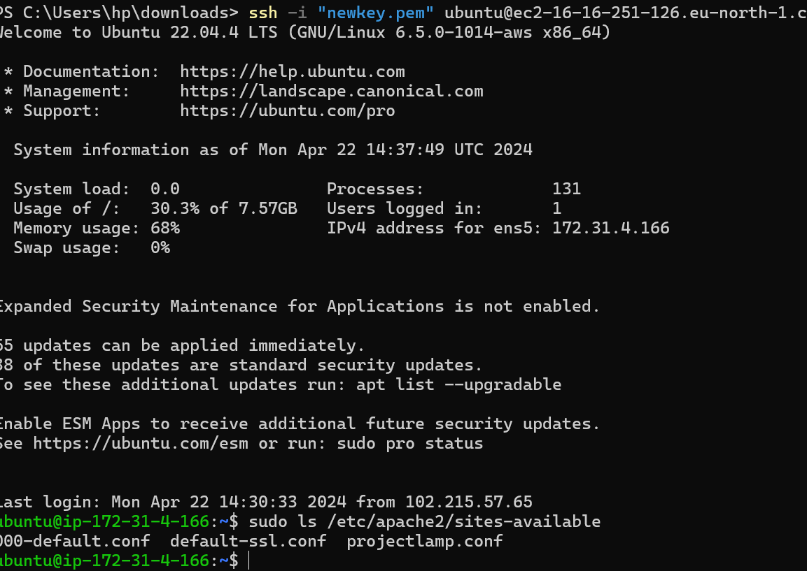

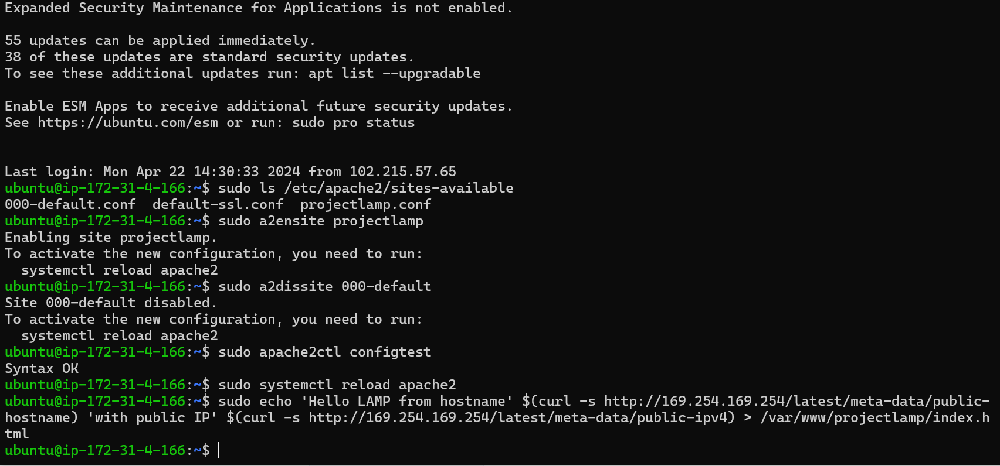

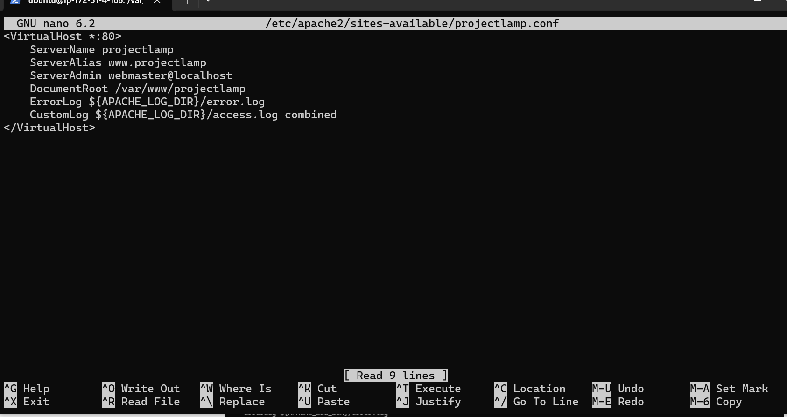

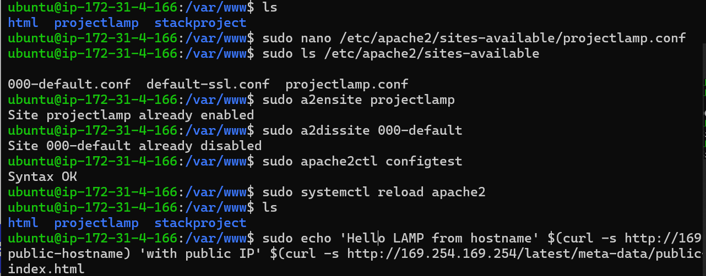

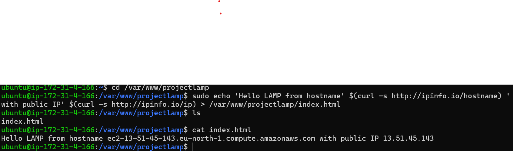

## To try to open my website through my web browser, using the my public IP, run the below command.
http://<Public-IP-Address>:80

## Testing PHP with Nginx
Inside the ProjectLEMP folder, create a LEMP file with the name info.php.
touch info.php

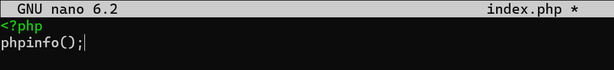

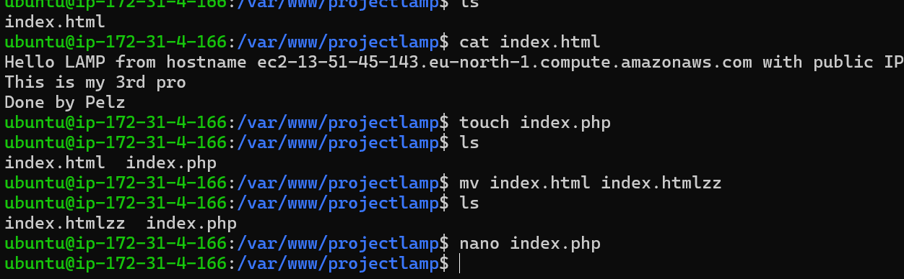

## Open the php page with Ip address
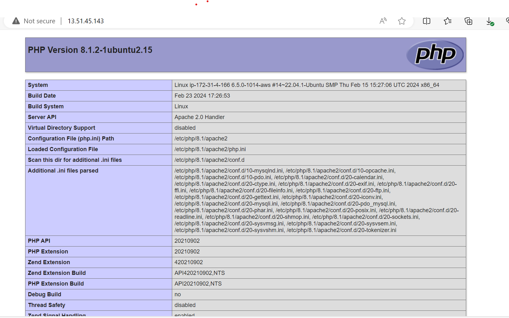

