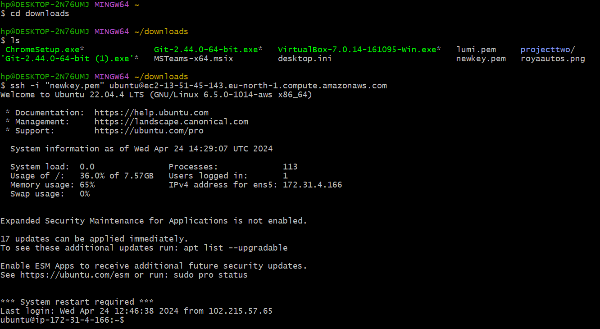
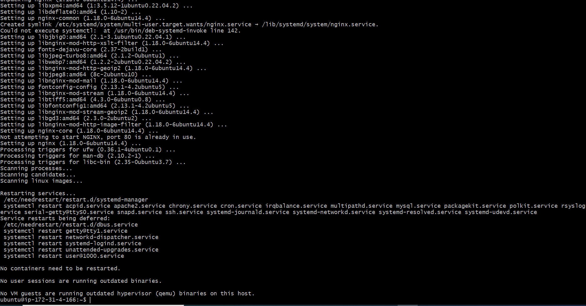
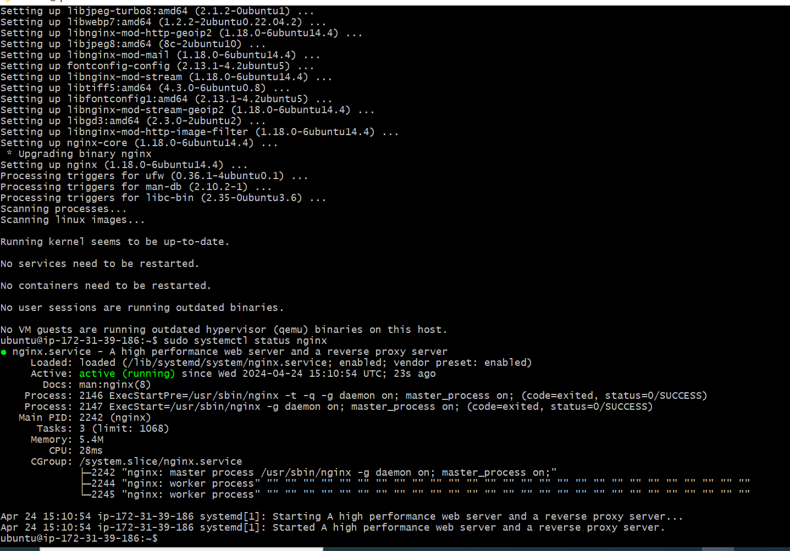
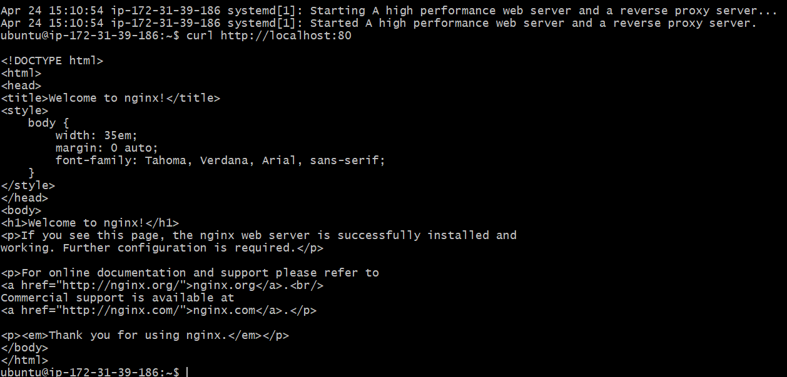

# Web Stack Implementation (LEMP STACK)!

## Shows that the Instance has been succesfully connected

## Installing the Nginx Web Server
sudo apt update

## To verify that nginx was installed properly
sudo systemctl status nginx

## To access Nginx server via local machine
Run curl http://localhost:80
or curl http://127.0.0.1:80

