# Web Stack Implementation (LEMP STACK)!

## Shows that the Instance has been succesfully connected

## Installing the Nginx Web Server
sudo apt update

## To verify that nginx was installed properly
sudo systemctl status nginx

## To access Nginx server via local machine
Run curl http://localhost:80
or curl http://127.0.0.1:80

## To Access Nginx via the web browser using the public IP Address.
http://<Public-IP-Address>:80

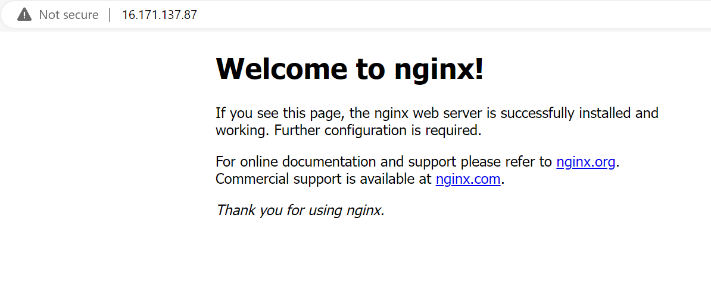

## To Install mysql on Nginx Server
sudo apt install mysql-server

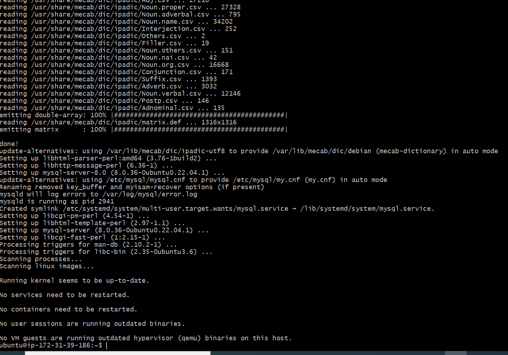

## To Login into mysql console
sudo mysql

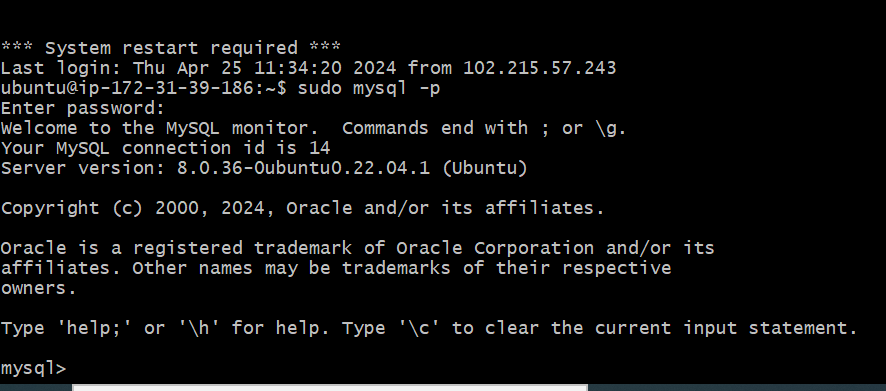

## To Install the 2 packages.
sudo apt install php-fpm php-mysql

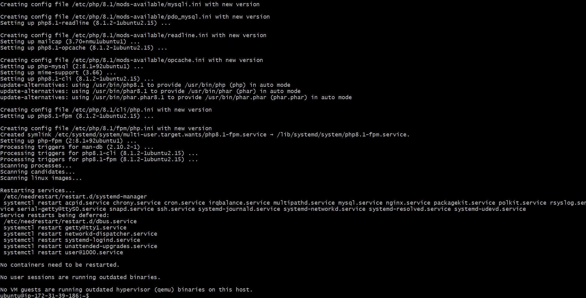

## Create a folder called projectLEMP
sudo mkdir /var/www/projectLEMP

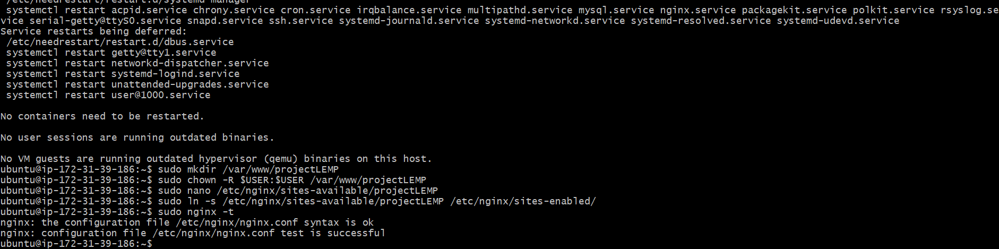
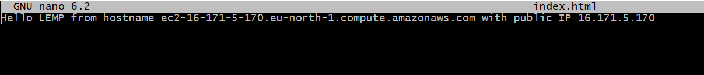

## To try to open my website through my web browser, using the my public IP, run the below command.
http://<Public-IP-Address>:80

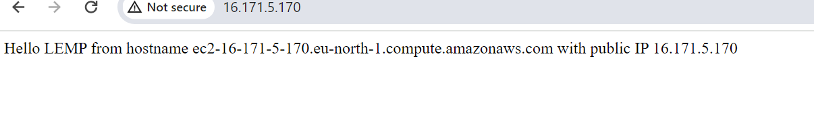

## Testing PHP with Nginx
Inside the ProjectLEMP folder, create a LEMP file with the name info.php.
touch info.php

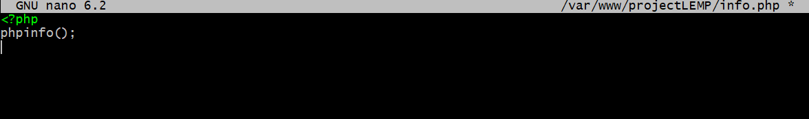

## Now, we can access this page in the web browser by visiting the domain name or public IP address we had setup in the Nginx configuration file.
http://`server_domain_or_IP`/info.php

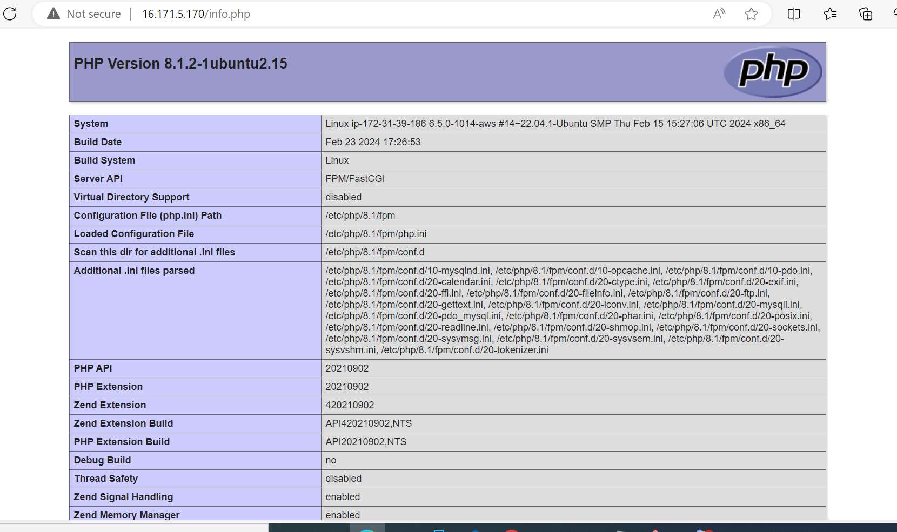

Connect to MySQL using the below command, provide your MySQL password to gain entrance to the database
sudo mysql -p

Create a new Database by running the below command
CREATE DATABASE example_database;

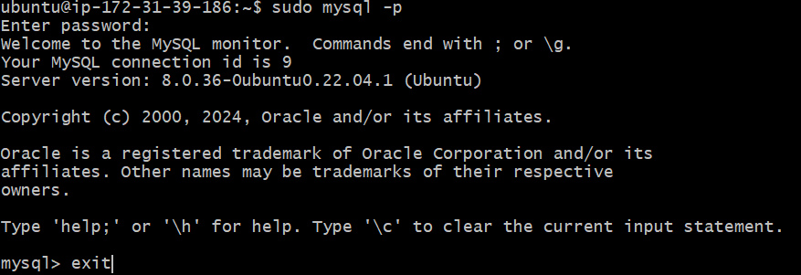

## Create a new user and grant him full priviledges on the database you have just created. create a new user with the name example_user, using mysql_native_password as default authentication method. We're defining the user's password as PassWord.1 but will be replacing the password with a more secured password.
CREATE USER 'example_user'@'%' IDENTIFIED WITH mysql_native_password BY 'PassWord.1';

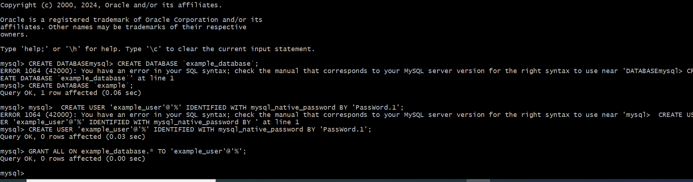

## Show the list of MySQL Databases
SHOW DATABASES;

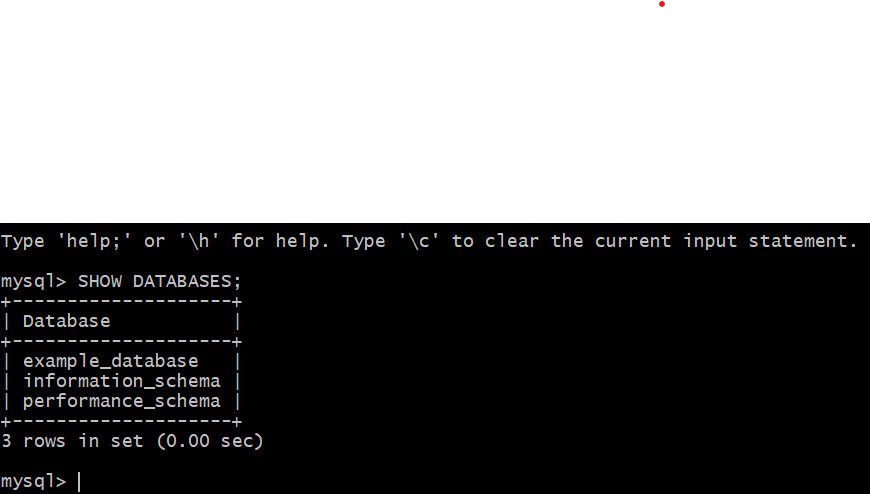

## We will create a table called todo_list using the command below
CREATE TABLE example_database.todo_list (item_id INT AUTO_INCREMENT,content VARCHAR(255),PRIMARY KEY(item_id));

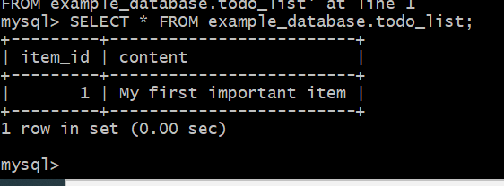

## Now, I will create a PHP script that will connect to MySQL and query for the content. Create a new PHP file called todo_list.php from the custom root directory using the below command

nano /var/www/projectLEMP/todo_list.php
<Images/Create a new PHP file called todo_list.php>
Copy the below content into the nano file editor. Kindly note that the below PHP script connects to the MySQL database and queries for the content of the todo_list table; displays the result in a list.

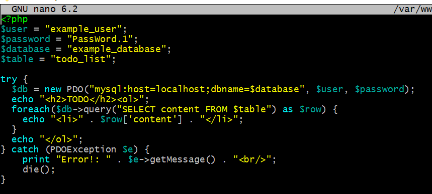

## I can now access the page in my web broswer by visiting the public IP address for my website follwoed by /todo_list.php:.

http://<Public_domain_or_IP>/todo_list.php

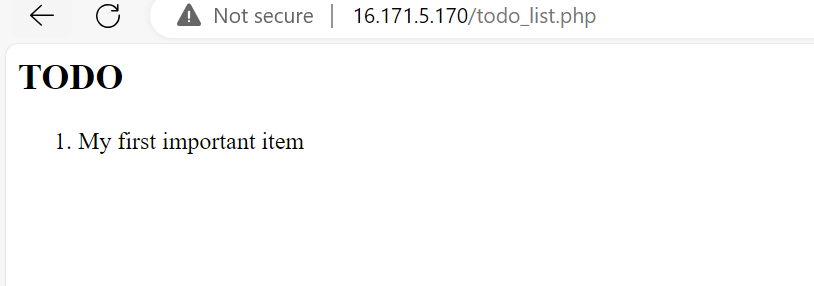

