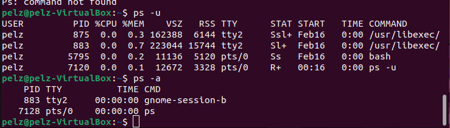

# Dareyio linux documentation!
### These are screenshots of the various commands I used to get familiar with linux

**Sudo**

**This is the print working directory command**

**This is the List command**

**This command is for creating files and folders with mkdir and touch**

**This command is for checking for the space used by various folders**

**The du command offers the total size of a specific folder**

**The locate command is used to find a file in the database system**

**The grep command is used to search through log files.

**The chmod-rw command is used to remove all the permissions from a file/user group**

**The ping command is used for checking whether a network or a server is reachable**

**The widget command let's us download files from the internet**

**The uname command will print detailed information about your linux system and hardware**

**The alias command allows you to create a shortcut with the same functionality as a command,filename or text**

**The hostname command allows us to know the system's hostname**

**The history command will make the system list up to 500 previously executed commands,alllowing them to be re-used without re-entering**

**The "Ps ux" command is used when you want to know the PID(Process Identification number) when trying to terminate an unresponsive program**

**The ls command is used to list everything in a folder or file**

**The rm command is used to remove a file**

**The chmod command is used to add permission to a usergroup**

**The find command is used to look for a file within a specific directory and perform operations**

**The Jed command has a drop down menu interface that allows us to perform actions without entering keyoard combinations or commands**

**The echo command is used to display an output without trailing a new line**

**The apt get command is used for handling advanced package tool (APT) libraries in linux**

**The ps command produces a snapshot of all the running processess in the system**

**The head command allows us to view the first ten lines of a text**

