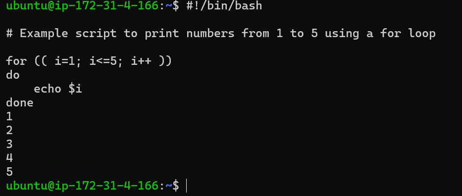
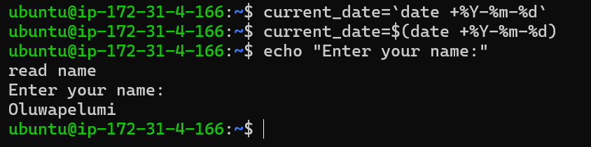
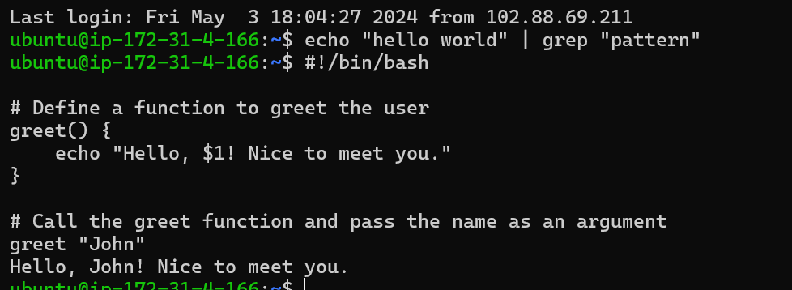
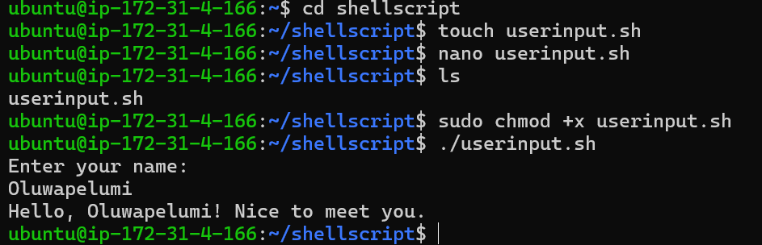
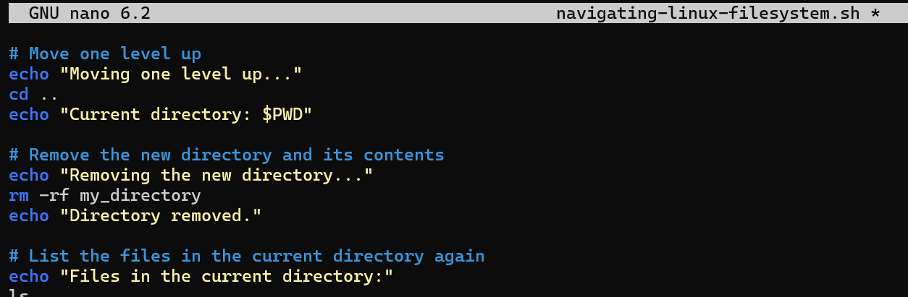
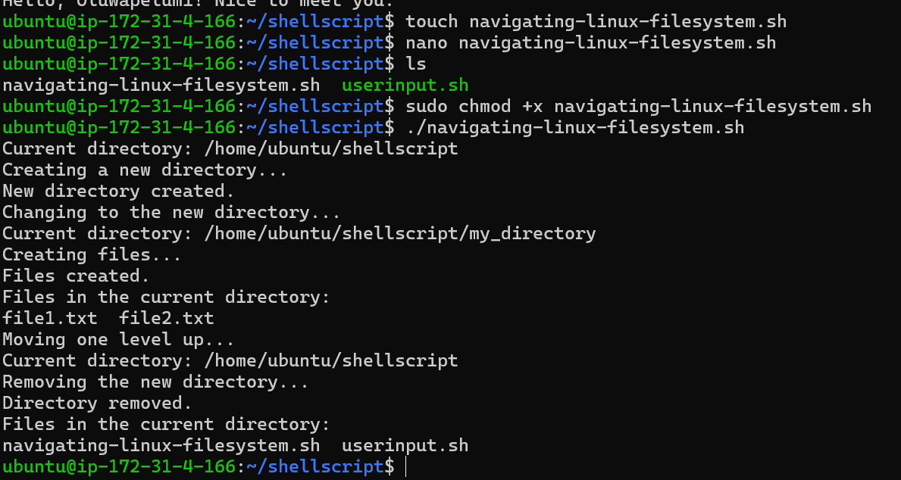
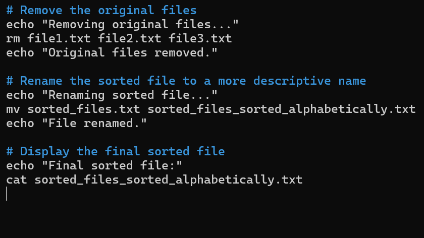
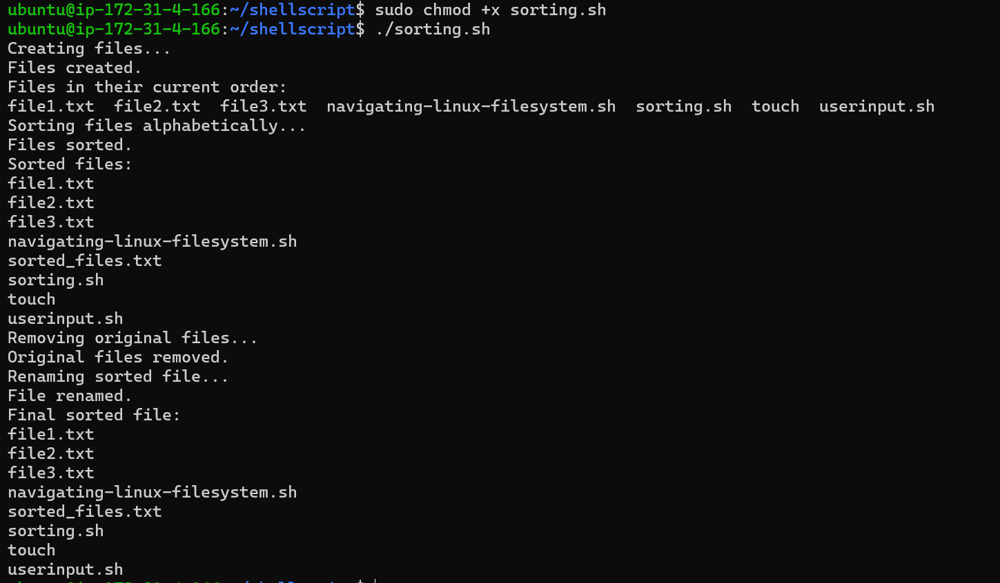
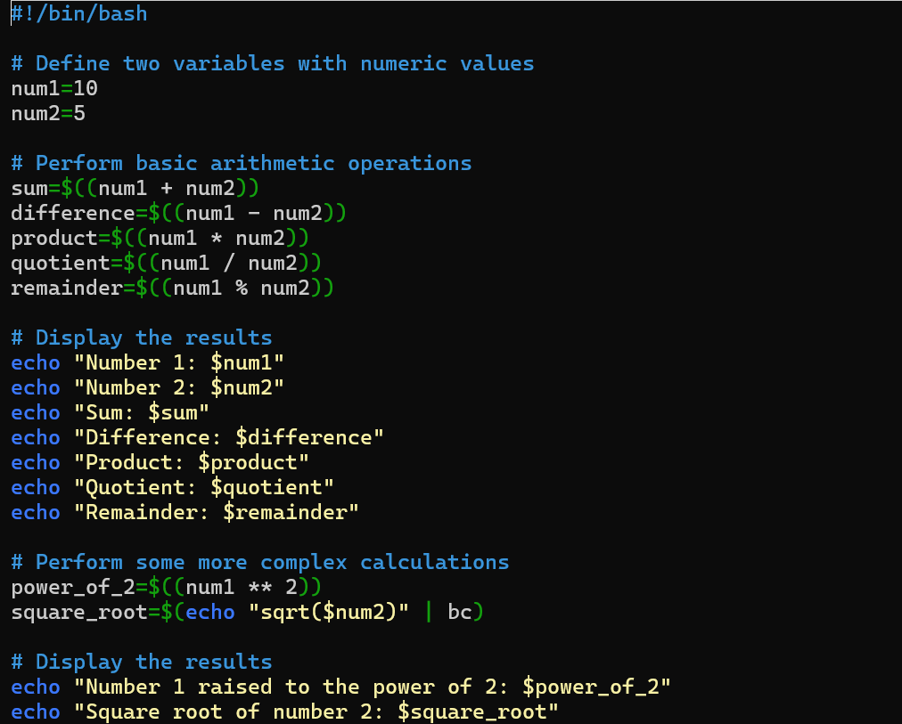
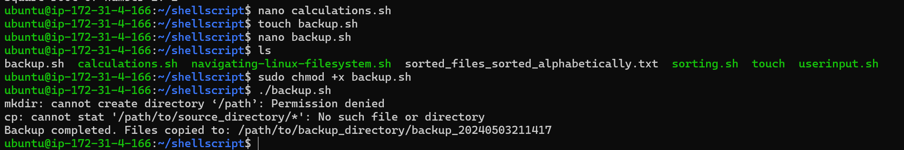

## SHELL SCRIPTING HANDS-ON PROJECTS.

 ## EG. Assigning a value to a variable
name="John"

## Example script to check if a number is positive, negative, or zero
read -p "Enter a number: " num

## Iterating through a list using a for loop

## Accept user input
echo "Enter your name:"
read name

## Bash allows you to define and use functions to group related commands together. Functions provide a way to modularize your code and make it more reusable. You can define functions using the function keyword or simply by declaring the function name followed by parentheses.

## cd into the shell-scripting folder and create a file called user-input.sh
touch user-input.sh

## nano navigating-linux-filesystem

## Open the terminal and create a file called sorting.sh using the command
touch sorting.sh

## nano backup.sh

## 

##

