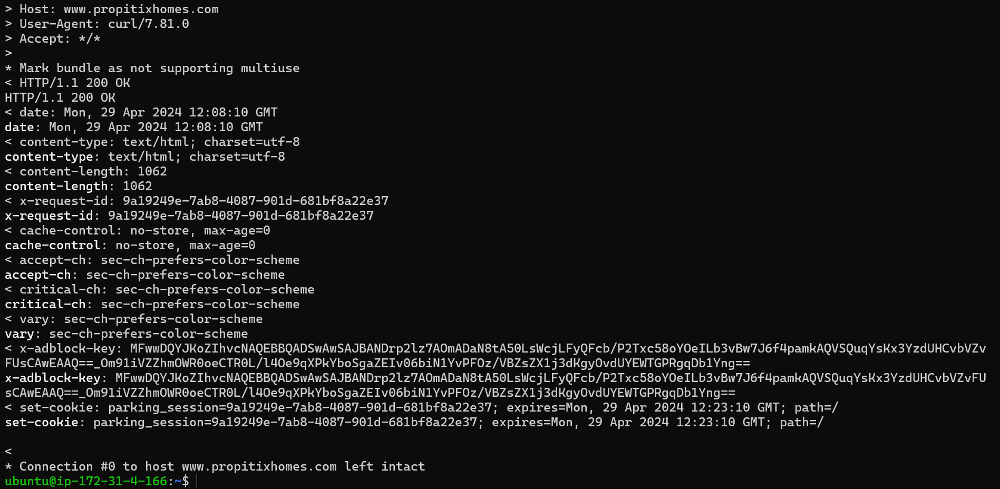

## IMPLEMENTING CLIENT-SERVER ARCHITECTURE USING MYSQL DATABASE MANAGEMENT SYSTEM
To demonstrate basic client-server using MySQL RDBMS
Create and configure two linux based virtual servers (EC2 instances on AWS)
Server 1: MySQL-Server (To serve information)
Server 2: MySQL-Client (To request information)

