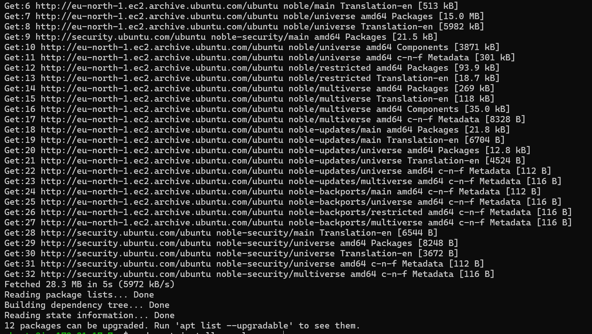
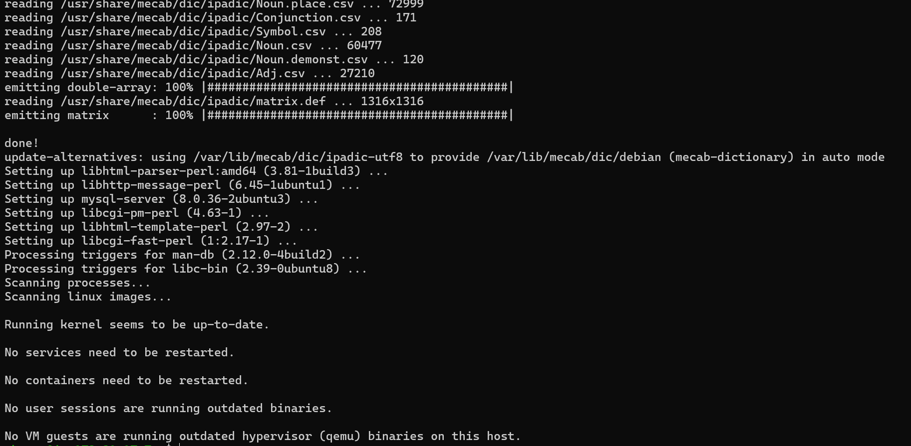
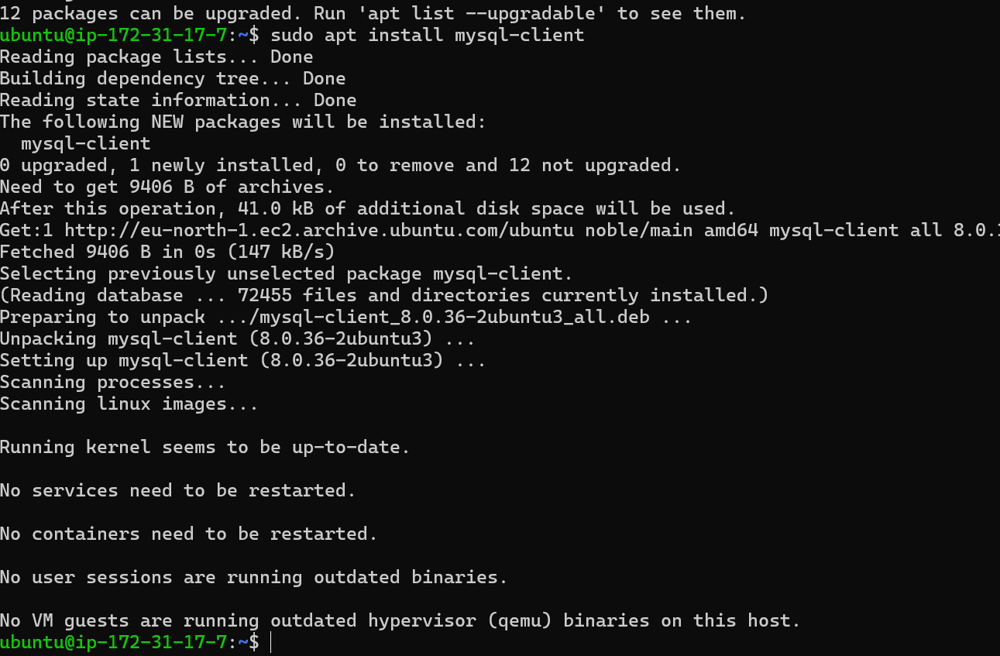
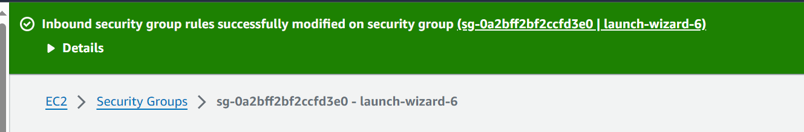
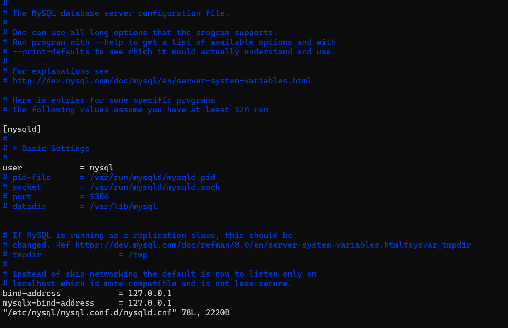
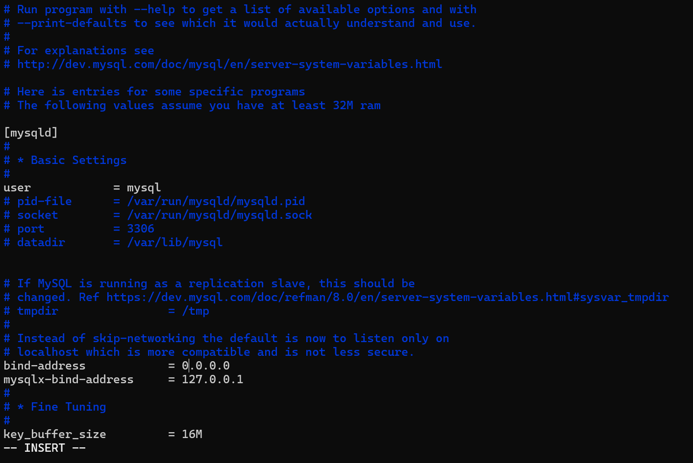

# IMPLEMENTING CLIENT-SERVER ARCHITECTURE USING MYSQL DATABASE MANAGEMENT SYSTEM

## To demonstrate basic client-server using MySQL RDBMS
Create and configure two linux based virtual servers (EC2 instances on AWS)
Server 1: MySQL-Server (To serve information)
Server 2: MySQL-Client (To request information)

## I ran the command sudo apt update to update both servers
sudo apt update

## I ran the command sudo apt install mysql-server to install mysql-server and sudo apt install mysql-client
sudo apt install mysql-server

## By default both EC2 virtual servers are located in the same local virtual network. so they can communicate with eachother using using local IP address
Add mysql client private ip to mysql server inbound rule to grant client access to server.

## Configure MySQL server to allow connects from remote hosts.
sudo nano /etc/mysql/mysql.conf.d/mysqld.cnf 
Replace the bind address (127.0.0.1) with the address 0.0.0.0

