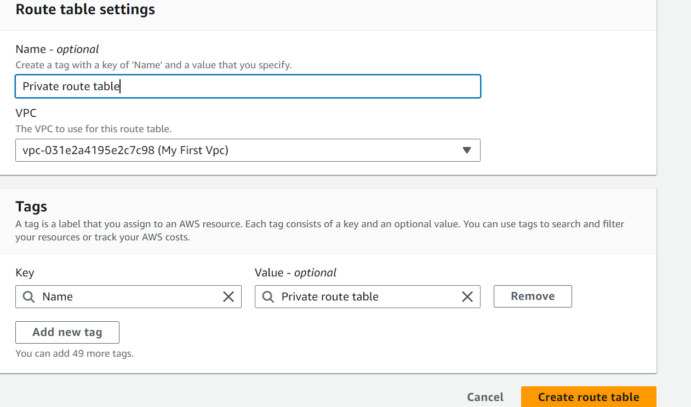

## AWS Networking implementation (VPC, Subnets, IG, NAT, Routing)

## Provisioning a VPC

## Creating a new VPC
To create a new vpc choose the "VPC only" option, we'll use the "VPC and more" option later.

Enter "first-vpc" as the name tag and "10.0.0.0/16" as the IPv4 CIDR.

The "10.0.0.0/16" will be the primary IPv4 block and you can add a secondary IPv4 block e.g., "100.64.0.0/16".

The use case of secondary CIDR block could be because you're running out of IPs and need to add additional block, or there's a VPC with overlapping CIDR which you need to peer or connect.

## Create Subnets and select the VPC that you've created previously -

the test-vpc or anything you tagged your VPC (first-vpc)

## Create an Internet Gateway (IGW) attached to the VPC

- Route table with default route towards the IGW

- Public IP assigned to the AWS resources (e.g., EC2 instances)

## Create a Route Table for Private Subnet!

## Create a NAT Gateway and Link It to the Private Subnet

## Thank You

